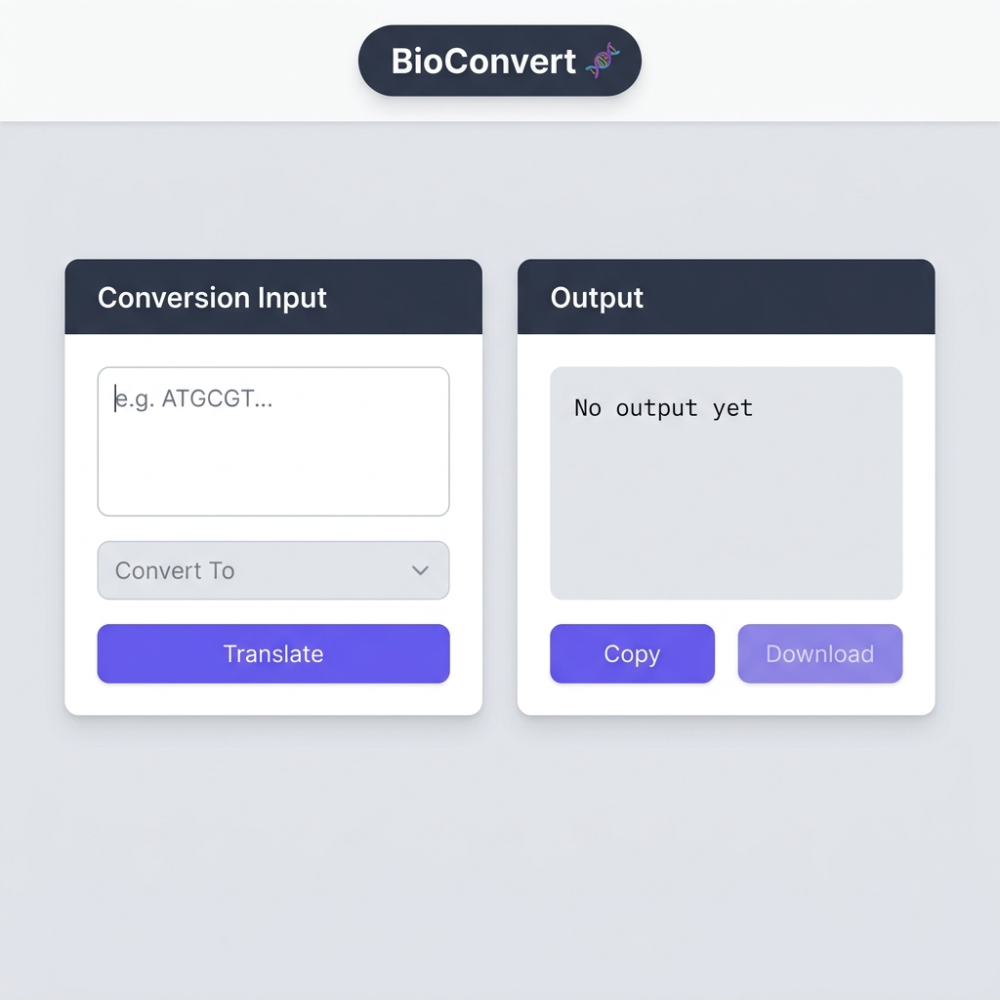
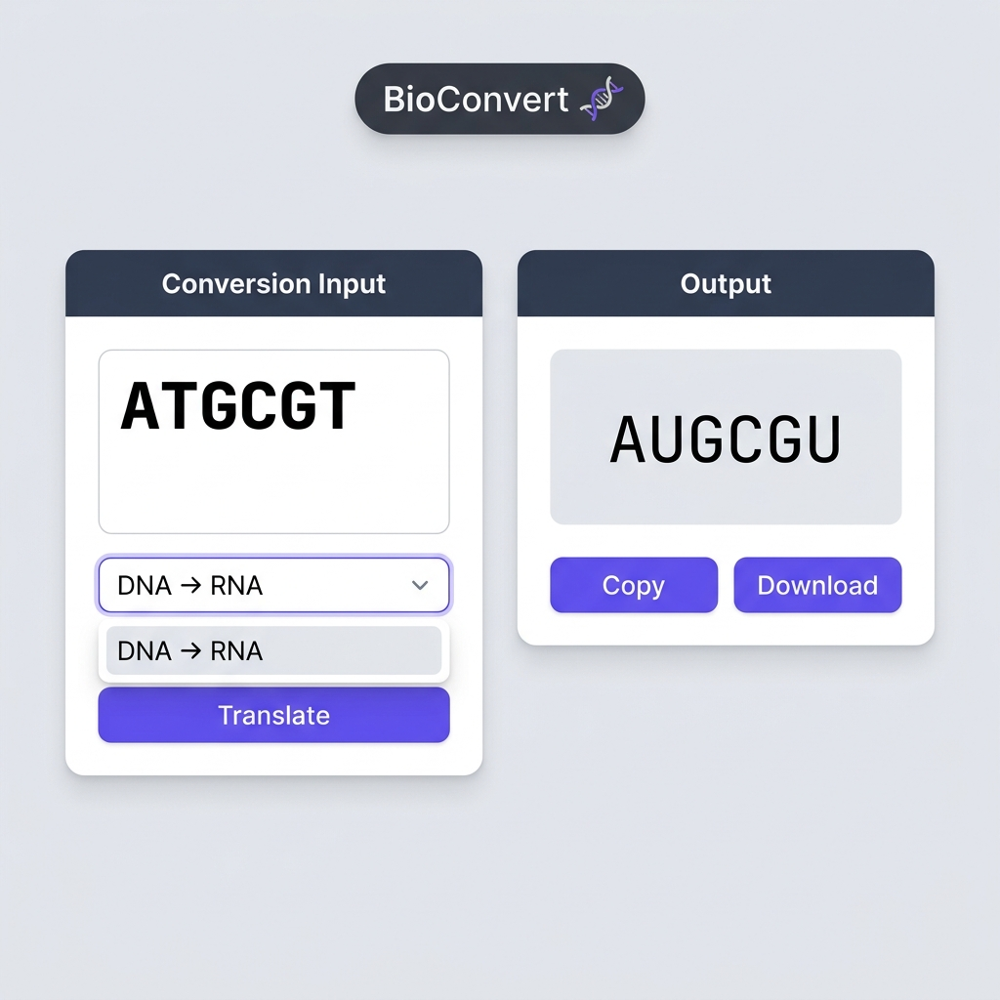

# BioConvert 🧬

A modern, responsive bioinformatics web application for translating and reverse-translating biological sequences — DNA, RNA, and Protein — built with React and Tailwind CSS v4.

BioConvert automatically detects your input sequence type in real-time, supports the full conversion matrix across all three sequence types, and lets you copy or download results instantly.

---

## Screenshots

| Initial State | After Translation |
|:---:|:---:|
|  |  |

---

## Features

- **Auto-Detection** — Automatically identifies whether the input is DNA, RNA, or Protein based on its molecular alphabet
- **Full Conversion Matrix** — Supports all six conversion directions:
  - DNA → RNA
  - DNA → Protein
  - RNA → DNA
  - RNA → Protein
  - Protein → DNA
  - Protein → RNA
- **Copy to Clipboard** — One-click copy of the translated output
- **Download Output** — Save results as a `.txt` file
- **Responsive Design** — Works seamlessly on desktop and tablet screens

---

## Tech Stack

| Layer | Technology |
|---|---|
| Framework | React 19 + Vite 6 |
| Styling | Tailwind CSS v4 |
| UI Components | Material UI (MUI) |
| Animations | Framer Motion |
| Package Manager | npm |

---

## Getting Started

### Prerequisites

- [Node.js](https://nodejs.org/) v18 or higher

### Installation

```bash
# Clone the repository
git clone https://github.com/Self-Lakshh/BioConvert.git
cd BioConvert

# Install dependencies
npm install

# Start the development server
npm run dev
```

### Build for Production

```bash
npm run build
```

---

## Project Structure

```
BioConvert/
├── public/
│   └── screenshot1.png
│   └── screenshot2.png
├── src/
│   ├── assets/
│   │   └── bioconvertlogo.jpg
│   ├── components/
│   │   ├── Header.jsx
│   │   ├── Footer.jsx
│   │   ├── InputBox.jsx
│   │   └── OutputBox.jsx
│   ├── utils/
│   │   └── translator.js
│   ├── App.jsx
│   └── main.jsx
├── index.html
└── package.json
```

---

## How It Works

1. Enter a biological sequence (e.g. `ATGCGT` for DNA, `AUGCGU` for RNA, or `MR` for Protein)
2. BioConvert automatically detects the sequence type
3. Select your desired conversion from the dropdown
4. Click **Translate** to see the result
5. Copy or download the output

---

## Authors

Made by **Lakshya Chopra** (23CS002830) and **Riya** (23CS002792)

---

## License

This project is licensed under the [MIT License](./LICENSE).